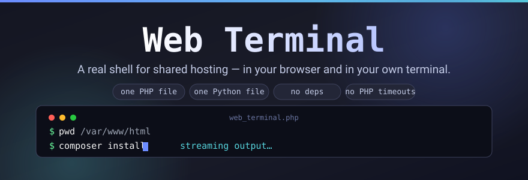

<p align="center">
  
</p>

# 🖥️ Web Terminal

**A real terminal for any PHP host that gives you no shell access** — open it in
your browser for live, streaming output, or drive the very same backend from
your own terminal with the bundled Python client. Drop `web_terminal.php` into
your web root, paste in a password hash, and you're running `ls`, `git`,
`composer` and `docker` on the server. Nothing to install, nothing to build,
no dependencies.

<table>
<tr><td width="50%" valign="top">

### 🖥️ In the browser

A dark, native-feeling terminal that fills the screen and never scrolls the
page itself:

- **Live output** — anything slow (a `composer install`, a `git clone`) becomes
  a background job and streams in as it runs.
- **Common commands** — press <kbd>Tab</kbd> for autocomplete, or type `cmds`
  for a clickable cheat sheet of the commands you'll actually use.
- **ANSI colors**, drag-and-drop upload, `download <path>`.
- **Jobs panel** — list, watch and kill background jobs.
- **System info panel**, plus dark/light theme and adjustable font size.
- **Full keyboard control** — `↑`/`↓` history, `Ctrl+L` clear, `Ctrl+C` kill.

</td><td width="50%" valign="top">

### ⌨️ From your own terminal

The same backend, driven by `webterm_client.py` — one dependency-free Python 3
file, standard library only:

- A familiar shell prompt with persistent `cd`.
- Upload/download straight from your terminal.
- **Scriptable one-shots** for cron, CI and automation:
  `python3 webterm_client.py URL -c "git pull"` — it even exits with the remote
  command's exit code.
- **API key** login so no password prompt in unattended jobs.

</td></tr>
</table>

```
web_terminal.php   the backend + browser UI, in one file
webterm_client.py  the CLI client, in one file
```

## Features

- **Dual mode** - use the browser, or run `webterm_client.py` from your own
  terminal against the same deployment. Both talk to the same JSON API, and
  share working directory and command history per login method.
- **Secure login** - the browser password is stored only as a bcrypt hash
  and checked server-side; after login the browser holds an HttpOnly
  session cookie plus a CSRF token, and the password itself is never kept
  client-side or resent. The CLI can use the same password/session flow,
  or skip interactive login entirely with a long-lived **API key**
  (bcrypt-hashed, sent as a header) - ideal for scripts, cron and CI.
  Failed logins/API-key attempts are rate-limited per IP, sessions expire
  when idle, and an optional IP allow-list is supported.
- **No PHP timeout on long commands** - `exec` starts every command as a
  real background process. Fast commands (the vast majority) return
  immediately and feel like a normal synchronous shell; anything that
  takes longer than a configurable grace period (1.2s by default)
  automatically becomes a background job that the browser/CLI polls and
  streams output from, so a `composer install`, `npm install`, `git
  clone`, backup, etc. is never cut off by PHP's request time limit.
- **Jobs you can manage** - list background jobs, re-attach to a running
  one (it survives a page reload, and multiple CLI invocations using the
  same API key share and can reattach to each other's jobs), and kill one
  - the kill signal is sent to the job's whole process group, not just its
  top-level shell, so it actually stops what it started. Jobs are scoped
  per identity: a browser login and an API key are separate identities, so
  a job started in the browser isn't visible to the CLI unless the CLI is
  also logged in with that same password/session.
- **Real shell behaviour** - `cd` persists between commands (per login
  identity - a browser session or an API key - whether you're in the
  browser or the CLI), stderr is merged into the output, the real exit
  code is reported even when the command itself calls `exit N`, and
  commands never hang waiting for keyboard input.
- **File transfer** - drag a file onto the browser terminal (or click
  Upload) to send it to the current directory; type `download <path>` in
  the browser, or use `webterm_client.py URL --upload/--download` or the
  CLI's `!upload`/`!download` from your own terminal.
- **ANSI colors** - SGR color/style codes (`ls --color`, `git -c
  color.ui=always diff`, colored test runners, etc.) render as real colors
  in the browser. The CLI just prints raw bytes, so your own terminal
  colors them natively.
- **Works on restricted hosting** - if `exec()` is disabled, the backend
  automatically falls back to `proc_open`, `shell_exec`, `passthru`,
  `system` or `popen`, whichever your host still allows.
- **Audit log** - every finished command is logged locally (timestamp, IP,
  identity, exit code, command text - not its output) to a file inside the
  protected data directory.
- **Built to feel like a native terminal** - the UI fills the viewport and the
  page itself never scrolls; only the output pane does. It adapts to phone
  screens and to the on-screen keyboard.
- **Common commands within reach** - <kbd>Tab</kbd> autocompletes what you're
  typing, an inline suggestion list appears as you type (<kbd>Tab</kbd> or a
  click takes the highlighted entry; `↑`/`↓` picks a different one), and
  `cmds` (or the **Cmds** button) opens a clickable cheat sheet of the
  everyday commands, with a one-line description each.
- **Dark/light theme and adjustable font size** in the browser, remembered
  per browser via `localStorage`.
- **Self-contained** - the whole web app is one PHP file; the CLI client
  is one Python file using only the standard library.

## Contents

- [Features](#features)
- [Quick start](#quick-start)
- [Getting started](#getting-started) — prerequisites, full installation, Windows hosts
- [Usage](#usage) — in the browser, from the CLI, troubleshooting, examples
- [Configuration](#configuration) — every constant, plus known limitations
- [Security considerations](#security-considerations)
- [Contributing](#contributing) · [License](#license)

## Quick start

If you just want it running:

```bash
git clone https://github.com/fattain-naime/js-web-terminal.git
cd js-web-terminal
php -r "echo password_hash('your-password', PASSWORD_DEFAULT), PHP_EOL;"
# paste the hash into TERMINAL_PASSWORD_HASH in web_terminal.php, then:
php -S 127.0.0.1:8000 -t .
```

Open `http://127.0.0.1:8000/web_terminal.php`, log in, and type `help` or
`cmds`. The full walkthrough — API keys, protecting the data directory, nginx
and Apache notes — is in [Installation](#installation) below.

## Getting Started

### Prerequisites

- A web server capable of running PHP (PHP 7.0+; a Linux/Unix host is
  needed for background jobs - see **Windows hosts** below). PHP's
  built-in server works fine for local testing.
- Python 3 on your own machine if you want to use the CLI client - no
  extra packages needed.

### Installation

1. Clone or download this repository to your web server's document root:

   ```bash
   git clone https://github.com/fattain-naime/js-web-terminal.git
   cd js-web-terminal
   ```

2. **Set your browser password.** Generate a bcrypt hash (run this locally
   or on any machine with PHP):

   ```bash
   php -r "echo password_hash('your-password', PASSWORD_DEFAULT), PHP_EOL;"
   ```

   Paste the result into `TERMINAL_PASSWORD_HASH` near the top of
   `web_terminal.php`:

   ```php
   const TERMINAL_PASSWORD_HASH = '$2y$10$...your hash...';
   ```

   Login stays disabled until a hash is set.  A legacy 32-character MD5 hash still works but
   bcrypt is strongly recommended.

3. **(Optional, recommended for the CLI) Set an API key**, so scripts and
   the CLI client don't need an interactive password prompt:

   ```bash
   php -r '$k = bin2hex(random_bytes(24)); echo $k, PHP_EOL, password_hash($k, PASSWORD_DEFAULT), PHP_EOL;'
   ```

   This prints two lines: the **raw key** (keep it for yourself - pass it
   to the CLI via `--api-key` or the `WEBTERM_API_KEY` environment
   variable; it is never stored anywhere) and its **bcrypt hash**, which
   goes into `TERMINAL_API_KEY_HASH`:

   ```php
   const TERMINAL_API_KEY_HASH = '$2y$10$...the second line...';
   ```

4. (Optional) Adjust other constants - IP allow-list, timeouts, job
   retention, upload size limit, audit log - see **Configuration** below.
   (Optional) Adjust colors/fonts in the `<style>` block in
   `web_terminal.php` to match your branding.

5. Deploy `web_terminal.php` into your document root (`webterm_client.py`
   stays on *your* machine - it never needs to be uploaded to the server).
   For local testing:

   ```bash
   php -S 127.0.0.1:8000 -t .
   ```

   Then open `http://127.0.0.1:8000/web_terminal.php` in your browser.

6. **Protect the data directory.** `web_terminal.php` creates a
   `.webterm_data/` folder next to itself (job logs, per-identity working
   directory and history, the audit log, brute-force lockout state) and
   writes its own `.htaccess`/`web.config` into it, but that only helps on
   Apache/IIS, and only if `AllowOverride` permits it. If your host uses
   Apache, also copy `.htaccess.example` to `.htaccess` **in the same
   folder as `web_terminal.php`** (see the comments inside) for defense in
   depth. **On nginx**, add a rule yourself to deny any dotfile/dotdir,
   e.g. `location ~ /\. { deny all; }` - nothing here does this
   automatically. Best of all: set `TERMINAL_DATA_DIR` (a constant near
   the top of the file) to a path **outside** the document root entirely,
   if your hosting lets you write there.

### Windows hosts

The background-job engine (and therefore `cd` persistence and job
list/kill) relies on POSIX shell features (`setsid`, `nohup`, process
groups, traps) and does not run on Windows. On a Windows host, every
command instead runs synchronously with a hard timeout
(`TERMINAL_COMMAND_TIMEOUT`), the same way the original single-shot
version of this script worked - no `cd` persistence, no background jobs.
Everything else (login, API key, upload/download, audit log) still works.
For the full feature set, use a Linux/Unix host.

## Usage

### In the browser

1. Open the script URL. You'll see a login overlay.
2. Enter your password and click **Login**.
3. Type commands and press `Enter`. Anything slow automatically becomes a
   background job - watch the status bar at the bottom, and use **Kill**
   to stop it.
4. Don't want to remember the exact spelling? Start typing and the
   suggestion list appears - <kbd>Tab</kbd> accepts the highlighted entry,
   `↑`/`↓` picks a different one, and clicking works too. <kbd>Enter</kbd>
   always runs what you typed, just like a real shell. Type `cmds` (or press
   **Cmds**) for the full cheat sheet, where every common command has a
   one-line description and a click-to-run button.
5. Drag a file onto the terminal (or click **Upload**) to send it to the
   current directory. Type `download <path>` to pull a file down.
6. `Up`/`Down` for history, `Ctrl+L` to clear, `Ctrl+C` to kill the
   currently running job.
7. Use the **Info** button for a system-info panel, **Jobs** to see/kill/
   re-attach to background jobs, **Theme**/**A+**/**A-** for display
   preferences.
8. Type `help` inside the terminal for the full list of built-in client
   commands (`clear`, `exit`, `theme`, `upload`, `download <path>`,
   `jobs`, `cmds`).

### Keyboard

**Autocomplete**

- <kbd>Tab</kbd> — complete the word you're typing, or take the highlighted suggestion
- <kbd>↑</kbd> / <kbd>↓</kbd> — move to a different suggestion while the list is open
- <kbd>Esc</kbd> — dismiss the suggestion list
- <kbd>Enter</kbd> — run what you typed; the suggestion list never swallows it

**Terminal**

- <kbd>↑</kbd> / <kbd>↓</kbd> — previous / next command in history
- <kbd>Ctrl</kbd>+<kbd>L</kbd> — clear the screen
- <kbd>Ctrl</kbd>+<kbd>C</kbd> — kill the running job

### From your own terminal (CLI)

```bash
# Interactive shell, prompts for your password:
python3 webterm_client.py https://example.com/web_terminal.php

# One-shot command (handy for scripts / cron / CI) - exits with the
# remote command's exit code:
python3 webterm_client.py https://example.com/web_terminal.php -c "git pull"

# Non-interactive, using an API key instead of a password:
export WEBTERM_API_KEY=xxxxxxxx
python3 webterm_client.py https://example.com/web_terminal.php -c "uname -a"

# Or pass the key directly (the env var is preferable - it stays out of shell history):
python3 webterm_client.py https://example.com/web_terminal.php --api-key xxxx -c "uname -a"

# Upload / download without entering the interactive shell:
python3 webterm_client.py URL --upload ./build.zip build.zip
python3 webterm_client.py URL --download remote.log ./remote.log

# Save the URL + API key (never the password) for next time:
python3 webterm_client.py URL --api-key xxxx --save
python3 webterm_client.py -c "pwd"   # reuses the saved profile
```

Inside the interactive CLI shell, built-ins start with `!` so they're
never confused with a real shell command:

```
!upload <local> <remote>     upload a local file to the server
!download <remote> <local>   download a remote file
!jobs                        list background jobs
!kill <job-id>                kill a background job
!history                     show shared command history
!clear                       clear the local screen
!help                        show this help
exit / logout / quit         log out and quit
```

Everything else is sent straight to the server and run as a real shell
command. A slow command streams its output as it polls, exactly like the
browser, and `Ctrl+C` sends a kill signal to whatever is currently
running. `cd` persists for the life of the API key or session, including
between separate one-shot invocations of the CLI when using an API key.

Run `python3 webterm_client.py --help` for all flags.

Environment variables: `WEBTERM_API_KEY` (same as `--api-key`),
`WEBTERM_USER_AGENT` (override the `User-Agent` header, in case your host's
WAF blocks the default one).

### Troubleshooting

| Symptom | What it means |
| --- | --- |
| `API key login failed: API key authentication is not enabled...` | `TERMINAL_API_KEY_HASH` is still empty on the server. |
| `API key login failed: Not authenticated...` | The key was received but did not match `TERMINAL_API_KEY_HASH`. Make sure you pass the **raw key**, not the hash. |
| `Too many failed attempts. Try again in N seconds.` | This IP hit the brute-force lockout (`TERMINAL_MAX_ATTEMPTS`). Wait it out, or raise the limit. |
| `Server returned HTTP 403 Forbidden...` | The request was blocked before it reached PHP: check `TERMINAL_ALLOWED_IPS`, and any WAF/CDN/mod_security rule in front of the script. |
| `No credentials received` | The server never saw your key, so the client retries once with the key in the JSON body — useful on hosts that strip custom headers. If it still fails, your host is blocking the request outright. Note the fallback only triggers against a `web_terminal.php` new enough to send that signal. |
| `Could not reach ...` / connection refused | Wrong URL, or the script isn't deployed there. Note that `web_terminal.php` must be reachable at the exact URL you pass. |

### Example

After logging in (either mode), try:

```sh
pwd                 # show the current working directory
ls -la               # list files in long format
php -v               # show the PHP version running on the server
composer install     # a slow command - becomes a background job automatically
```

## Configuration

All options are constants near the top of `web_terminal.php`:

| Constant | Purpose | Default |
| --- | --- | --- |
| `TERMINAL_PASSWORD_HASH` | bcrypt hash of your browser password | empty (login disabled) |
| `TERMINAL_API_KEY_HASH` | bcrypt hash of your CLI/API key | empty (API key auth disabled) |
| `TERMINAL_ALLOWED_IPS` | Only these IPs may use the page/API, e.g. `['203.0.113.10']` | `[]` (everyone) |
| `TERMINAL_MAX_ATTEMPTS` / `TERMINAL_LOCKOUT_SECONDS` | Failed logins/API-key checks before an IP is locked out, and for how long | `5` / `300` |
| `TERMINAL_IDLE_TIMEOUT` | Browser session auto-logout after inactivity (seconds) | `1800` |
| `TERMINAL_SYNC_GRACE_MS` | How long `exec` waits before returning an in-progress job instead of the final result | `1200` |
| `TERMINAL_JOB_MAX_RUNTIME` | Background jobs are auto-killed after this many seconds | `3600` |
| `TERMINAL_JOB_RETENTION` | How long a finished job's output is kept before cleanup | `1800` |
| `TERMINAL_COMMAND_TIMEOUT` | Hard timeout on Windows hosts (no background jobs there) | `60` |
| `TERMINAL_MAX_OUTPUT` | Max output bytes returned per `exec`/`poll` call | `1048576` |
| `TERMINAL_MAX_COMMAND_LEN` | Max length of a submitted command | `16384` |
| `TERMINAL_MAX_UPLOAD_BYTES` | Soft cap for a single upload (also bounded by `php.ini`) | `26214400` (25 MB) |
| `TERMINAL_DATA_DIR` | Where job logs, per-identity cwd/history and the audit log live | `.webterm_data` next to the script |
| `TERMINAL_ENABLE_AUDIT_LOG` | Log every finished command (not its output) | `true` |
| `TERMINAL_ENABLE_HISTORY` | Keep shared command history per identity | `true` |

The terminal starts in the directory containing `web_terminal.php`; use
`cd` as usual. Working directory and history are tracked **per identity**
on the server: one browser session is one identity, and the API key is a
second, shared identity (so all CLI invocations using the same key share
one `cd` history - handy for scripting, since `cd /some/project` in one
CLI call is still in effect on the next).

### Known limitations

- Environment variables set with `export` do **not** persist between
  separate commands (only the working directory does) - each command
  runs as a fresh background job. Chain with `&&`, or set the variable
  inline (`FOO=bar command`), when you need both in one line.
- There is no real PTY, so full-screen interactive programs (`vim`,
  `top`, a pager without `-F`/`| cat`) won't behave as they would over
  SSH. Use non-interactive equivalents.
- Killing a job sends a process-group signal (via `setsid`, when
  available) so it reaches the command and anything it has forked - but a
  process that re-forks after the signal, or deliberately daemonizes
  itself out of its process group, may still survive. `setsid` is present
  on essentially all Linux hosts; where it's missing, kill falls back to
  signaling the job's direct process and children only.
- No background jobs, `cd` persistence, or kill on Windows hosts (see
  **Windows hosts** above).

## Security Considerations

This project intentionally removes command restrictions to provide
maximum flexibility. As a result, **it will execute any command** the
authenticated user or API key supplies. Keep in mind:

- **Always use HTTPS.** Without it, your password, API key, commands and
  file transfers travel in clear text (the page warns you when it isn't).
- **Restrict access** with `TERMINAL_ALLOWED_IPS` and/or HTTP Basic Auth
  in front of the script where you can, and use a strong, unique password
  and a long, random API key.
- **Treat the API key like a second password** - anyone who has it can
  run any command, with no browser login required.
- **Protect `.webterm_data/`** (see step 6 of Installation above) - it
  holds job output, command history and the audit log, which can contain
  sensitive data from whatever you've run.
- **Review the audit log** occasionally (inside `.webterm_data/`).
- **Delete the file (and `.webterm_data/`) when you are done** if you
  don't need it permanently.
- **Run in a sandboxed or isolated environment** if possible. Misuse of
  this tool could lead to data loss or server compromise.

If you need a more constrained environment, consider reintroducing an
allow-list of safe commands.

## Contributing

Pull requests are welcome! If you have ideas for improvements - additional
authentication mechanisms, more client commands, UI enhancements - feel
free to open an issue or submit a PR.

## License

This project is licensed under the GPL v2.0 License. See the [LICENSE](https://github.com/fattain-naime/js-web-terminal/blob/main/LICENSE) file for details.
